# 세계 문학 작가 퀴즈

터미널에서 동작하는 4지선다 퀴즈 게임. Python 표준 라이브러리만 사용.

---

## I. 프로젝트 개요

문제를 출제하고 채점하는 콘솔 프로그램. 퀴즈를 직접 등록할 수 있고, 종료 후 다시 실행해도 등록한 퀴즈와 최고 점수가 유지된다.

### 개발환경

| 항목 | 값 |
|---|---|
| 언어 | Python 3.14.6 (3.10 이상 필요) |
| 외부 라이브러리 | 없음 (표준 라이브러리만) |
| OS | Windows 11 |
| 터미널 | PowerShell, WSL(Ubuntu) |
| 편집기 | Visual Studio Code |
| 버전 관리 | Git 2.55.0.windows.3 |

### 과제 목표

Python 기본 문법으로 콘솔 프로그램 하나를 처음부터 끝까지 완성하고, 그 과정을 Git으로 기록한다.

- **객체 지향** — 역할이 다른 클래스로 코드 분리
- **데이터 영속성** — JSON 파일 저장으로 종료 후에도 데이터 유지
- **예외 처리** — 잘못된 입력, 강제 종료, 손상된 데이터 파일에도 비정상 종료 없음

Git 측면에서는 기능 단위 커밋, 브랜치 분리와 병합, 원격 저장소 활용(`clone` / `pull`)을 직접 수행했다.

---

## II. 퀴즈 주제 선정 이유

주제: **세계 문학 작가**

평소 세계문학을 즐겨 읽고 작가들에게도 관심이 많아 선택했다. 아는 분야라 문제와 오답 선택지를 직접 만들 수 있었고, 5문제를 채우는 데 별도 조사가 거의 필요 없었다. 형식 면에서도 작품과 작가의 짝은 정답이 하나로 정해져 4지선다에 맞았다. 오답 선택지를 같은 시대·국적의 작가로 채우면 난이도 조절이 가능했다.

기본 문제 5개.

| # | 문제 | 정답 |
|---|---|---|
| 1 | '레 미제라블'의 저자로 프랑스의 대문호인 작가는? | 빅토르 위고 |
| 2 | 소설 '1984'와 '동물농장'을 쓴 영국 작가는? | 조지 오웰 |
| 3 | 1946년 노벨 문학상을 수상했으며, '데미안', '수레바퀴 아래서' 등을 집필한 독일의 작가는? | 헤르만 헤세 |
| 4 | 미국 잃어버린 세대의 대표 작가로 '위대한 개츠비'를 쓴 사람은? | F. 스콧 피츠제럴드 |
| 5 | 러시아 문학의 거장으로 '죄와 벌'을 집필한 작가는? | 표도르 도스토옙스키 |

---

## III. 실행 방법

Python 3.10 이상 필요. 설치할 라이브러리 없음.

```bash
git clone https://github.com/hauteville1862/e2-final.git
cd e2-final
python main.py
```

첫 실행 시 `state.json`이 없으므로 기본 퀴즈 5개로 시작. 퀴즈를 풀거나 추가하면 파일이 자동 생성된다.

### 메뉴 화면

```
PS C:\Users\Yuhyun Lim\e2-final> python main.py
========================================
      세계 문학 작가 퀴즈
========================================
  1. 퀴즈 시작
  2. 퀴즈 추가
  3. 퀴즈 목록 보기
  4. 최고 점수 확인
  5. 종료
----------------------------------------
메뉴를 선택하세요 (1-5):
```

<details>
<summary>menu.png</summary>

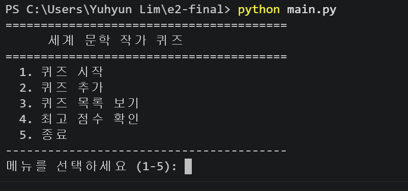

</details>

### 퀴즈 풀기

```
메뉴를 선택하세요 (1-5): 1

Q.1: '레 미제라블'의 저자로 프랑스의 대문호인 작가는?
   1) 빅토르 위고
   2) 에밀 졸라
   3) 기 드 모파상
   4) 알베르 카뮈

정답을 입력하세요 (1-4): 1
정답입니다!
현재 점수: 1/1

Q.2: 소설 '1984'와 '동물농장'을 쓴 영국 작가는?
   1) 올더스 헉슬리
   2) 조지 오웰
   3) 버지니아 울프
   4) 제임스 조이스

정답을 입력하세요 (1-4): 3
틀렸습니다.
정답은 2번이었습니다.
현재 점수: 1/2
```

<details>
<summary>play.png</summary>

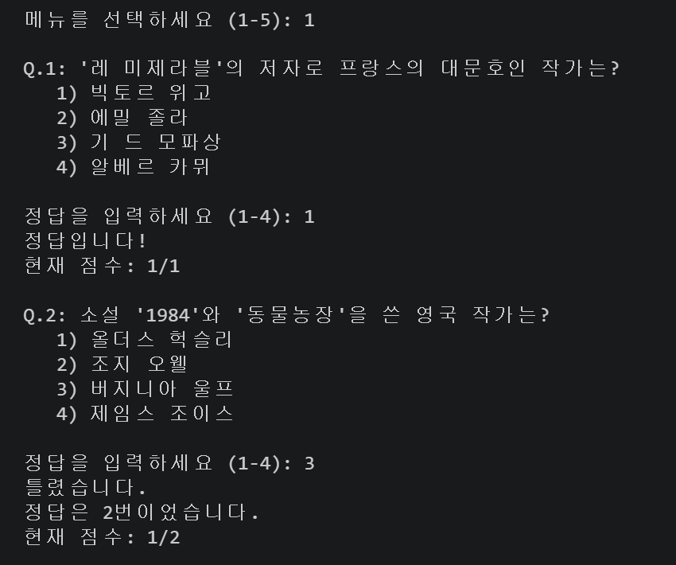

</details>

### 퀴즈 추가

```
메뉴를 선택하세요 (1-5): 2
[새 문제 추가]
문제 내용을 입력하세요: 새 문제 추가 테스트
보기 1번을 입력하세요: 1
보기 2번을 입력하세요: 2
보기 3번을 입력하세요: 3
보기 4번을 입력하세요: 4
정답 번호를 입력하세요 (1-4): 1

문제가 성공적으로 추가되었습니다!

엔터를 누르면 메뉴로 돌아갑니다...
```

<details>
<summary>add_quiz.png</summary>

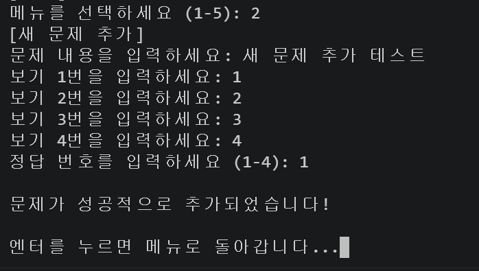

</details>

### 퀴즈 목록

```
메뉴를 선택하세요 (1-5): 3
[등록된 퀴즈 목록]
1. '레 미제라블'의 저자로 프랑스의 대문호인 작가는?
2. 소설 '1984'와 '동물농장'을 쓴 영국 작가는?
3. 1946년 노벨 문학상을 수상했으며, '데미안', '수레바퀴 아래서' 등을 집필한 독일의 작가는?
4. 미국 잃어버린 세대의 대표 작가로 '위대한 개츠비'를 쓴 사람은?
5. 러시아 문학의 거장으로 '죄와 벌'을 집필한 작가는?
------------------------------

엔터를 누르면 메뉴로 돌아갑니다...
```

<details>
<summary>quiz_list.png</summary>

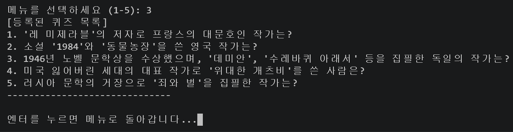

</details>

### 퀴즈 추가 후 목록 (5개 → 6개)

```
메뉴를 선택하세요 (1-5): 3
[등록된 퀴즈 목록]
1. '레 미제라블'의 저자로 프랑스의 대문호인 작가는?
2. 소설 '1984'와 '동물농장'을 쓴 영국 작가는?
3. 1946년 노벨 문학상을 수상했으며, '데미안', '수레바퀴 아래서' 등을 집필한 독일의 작가는?
4. 미국 잃어버린 세대의 대표 작가로 '위대한 개츠비'를 쓴 사람은?
5. 러시아 문학의 거장으로 '죄와 벌'을 집필한 작가는?
6. 새 문제 추가 테스트
------------------------------

엔터를 누르면 메뉴로 돌아갑니다...
```

<details>
<summary>quiz_list_after_add.png</summary>

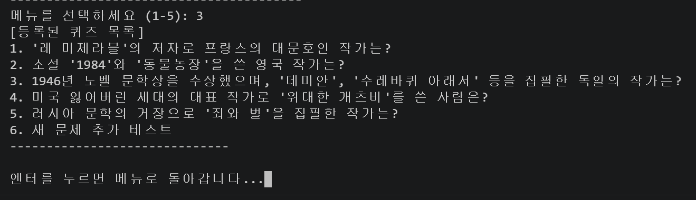

</details>

추가한 퀴즈가 `state.json`에 저장되어 목록에 반영된다.

### 점수 확인

```
메뉴를 선택하세요 (1-5): 4
[현재 최고 점수]

현재까지의 최고 기록은 2점입니다.
지금까지 1번 풀었습니다.

더 높은 점수에 도전해보세요!
------------------------------

엔터를 누르면 메뉴로 돌아갑니다...
```

<details>
<summary>score.png</summary>

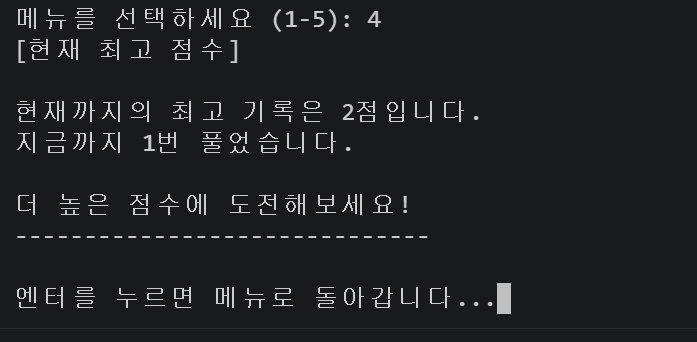

</details>

---

## IV. 기능 목록

1. **퀴즈 시작** — 저장된 퀴즈를 순서대로 출제. 문제마다 정답 여부와 현재 점수를 표시하고, 완료 시 최종 점수와 최고 점수 갱신 여부 출력
2. **퀴즈 추가** — 문제, 선택지 4개, 정답 번호를 입력받아 `state.json`에 저장
3. **퀴즈 목록 보기** — 등록된 문제 지문을 번호와 함께 출력. 정답은 미표시
4. **최고 점수 확인** — 최고 점수와 푼 횟수 출력. 미기록 시 별도 안내
5. **종료** — 프로그램 종료

<details>
<summary>메뉴와 기능 연결 코드 (quiz_cli.py)</summary>

```python
    def main_menu(self):
        while True:
            print("=" * 40)
            print("      세계 문학 작가 퀴즈")
            print("=" * 40)
            print("  1. 퀴즈 시작")
            print("  2. 퀴즈 추가")
            print("  3. 퀴즈 목록 보기")
            print("  4. 최고 점수 확인")
            print("  5. 종료")
            print("-" * 40)

            choice = self.get_valid_int("메뉴를 선택하세요 (1-5): ", 1, 5)

            if choice == 1:
                self.run_quiz()
            elif choice == 2:
                self.add_new_quiz()
            elif choice == 3:
                self.view_quiz_list()
            elif choice == 4:
                self.show_best_score()
            elif choice == 5:
                print("\n게임을 종료합니다. 이용해주셔서 감사합니다!")
                break
```

</details>

### 입력 예외 처리

입력에서 생기는 문제를 두 갈래로 나눴다. **잘못 입력한 것은 다시 묻고, 중단 신호는 저장하고 끝낸다.**

#### 다시 묻는다 — 잘못된 입력

검증 함수 두 개가 조건을 만족할 때까지 `while`로 되묻는다. 검사 대상만 다르다.

| 함수 | 걸러내는 입력 | 쓰이는 곳 |
|---|---|---|
| `get_valid_int(prompt, min, max)` | 빈 입력, 숫자 아님(`abc`), 범위 밖(`9`·`0`) | 메뉴 선택, 정답 입력, 정답 번호 |
| `get_nonempty_text(prompt)` | 빈 입력 | 문제 지문, 보기 1~4번 |

둘 다 `input(...).strip()`으로 앞뒤 공백을 먼저 없애므로 `" 1 "`도 `1`로 인식한다. 허용 범위는 인자로 넘기기 때문에 같은 함수를 세 곳에서 재사용한다.

```
메뉴를 선택하세요 (1-5): abc
[알림] 숫자만 입력 가능합니다.
메뉴를 선택하세요 (1-5): 8
[알림] 1~5 사이의 숫자를 입력해주세요.
메뉴를 선택하세요 (1-5):
[알림] 입력이 비어 있습니다. 다시 입력해주세요.
메뉴를 선택하세요 (1-5):
```

<details>
<summary>invalid_input.png</summary>

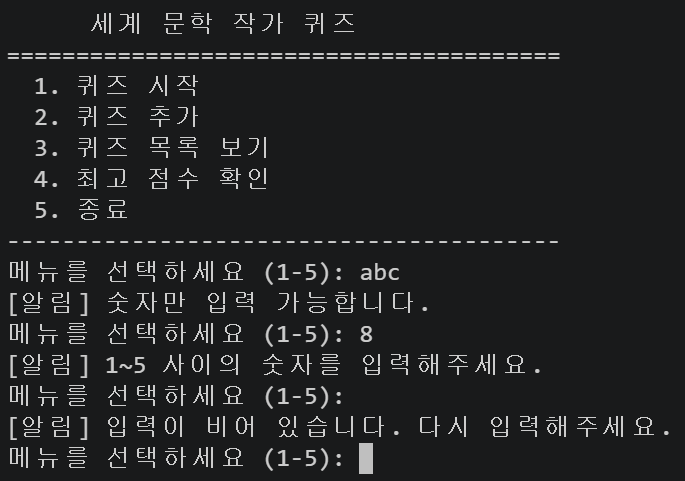

</details>

어느 경우든 프로그램이 멈추지 않고 같은 질문을 다시 던진다.

<details>
<summary>입력 검증 코드 (quiz_cli.py)</summary>

```python
    def get_valid_int(self, prompt, min_value, max_value):
        while True:
            raw = input(prompt).strip()

            if raw == "":
                print("[알림] 입력이 비어 있습니다. 다시 입력해주세요.")
                continue

            try:
                value = int(raw)
            except ValueError:
                print("[알림] 숫자만 입력 가능합니다.")
                continue

            if value < min_value or value > max_value:
                print(f"[알림] {min_value}~{max_value} 사이의 숫자를 입력해주세요.")
                continue

            return value

    def get_nonempty_text(self, prompt):
        while True:
            text = input(prompt).strip()

            if text == "":
                print("[알림] 내용은 비어 있을 수 없습니다.")
                continue

            return text
```

`while True`로 반복하다가 조건을 만족하면 `return`으로 빠져나오고, 아니면 안내 후 `continue`로 다시 묻는다.

</details>

#### 끝낸다 — Ctrl+C와 EOF

사용자가 `Ctrl+C`를 누르면 [`KeyboardInterrupt`](main.py#L10-L12), 입력 스트림이 닫히면 [`EOFError`](main.py#L13-L15)가 발생한다.

둘 다 프로그램 어디서든 나올 수 있다. `input()`마다 처리를 넣으면 같은 코드가 흩어지므로, 예외가 호출한 함수를 거슬러 올라오는 성질을 이용해 **진입점에서 한 번만** 잡는다.

퀴즈 도중이었다면 `run_quiz`가 먼저 기록을 저장하고 인자 없는 `raise`로 예외를 다시 던진다. **저장은 데이터를 아는 곳에서, 종료 안내는 진입점에서.**

<details>
<summary>강제 종료 처리 코드 (main.py, quiz_cli.py)</summary>

```python
if __name__ == "__main__":
    app = QuizCLI()
    try:
        app.main_menu()
    except KeyboardInterrupt:
        print("\n\n[알림] 강제 종료 신호(Ctrl+C)를 감지했습니다. 안전하게 종료합니다.")
        sys.exit(0)
    except EOFError:
        print("\n\n[알림] 입력이 종료되어 프로그램을 안전하게 종료합니다.")
        sys.exit(0)
```

```python
        except (KeyboardInterrupt, EOFError):
            print(f"퀴즈 중단! 지금까지 점수: {game.score}/{game.quiz_number}")
            self.save_result(data, game)
            raise
```

</details>

---

## V. 파일 구조

```
e2-final/
├── main.py           프로그램 진입점. Ctrl+C·EOF 처리
├── quiz_cli.py       QuizCLI  — 메뉴 출력, 입력 검증, 기능 흐름
├── quiz.py           Quiz     — 문제 하나의 데이터와 동작
├── quiz_game.py      QuizGame — 한 판의 진행 상태와 점수
├── storage.py        Storage  — state.json 읽기·쓰기, 손상 복구
├── state.json        실행 중 생성되는 데이터 파일
├── .gitignore
├── README.md
└── docs/
    ├── 미션.md
    ├── 평가기준.md
    ├── 작업기록.md
    └── screenshots/
```

### 클래스 책임 분리

분리 기준: **무엇이 바뀔 때 이 파일을 고치게 되는가**

| 클래스 | 책임 | 고치게 되는 때 |
|---|---|---|
| `Quiz` | 문제 하나의 데이터(지문·선택지·정답)와 동작(`show`, `is_correct`) | 퀴즈 구조 변경 (선택지 개수 등) |
| `QuizGame` | 한 판의 진행 상태 — 현재 문제 번호, 점수, 남은 문제 여부 | 채점 방식 변경 |
| `Storage` | `state.json` 읽기·쓰기, 파일 없음·손상 시 복구 | 저장 방식 변경 |
| `QuizCLI` | 메뉴 출력, 입력 검증, 위 세 클래스를 조합해 기능 완성 | 화면 문구·메뉴 구성 변경 |

---

## VI. 데이터 파일 설명

- **경로** — 프로젝트 루트의 `state.json`
- **인코딩** — UTF-8 (`ensure_ascii=False`로 한글 그대로 저장)
- **역할** — 등록된 퀴즈 목록과 점수 기록 보관. 종료 후에도 데이터가 남는 이유

```json
{
    "best_score": 4,
    "play_count": 3,
    "quizzes": [
        {
            "question": "'레 미제라블'의 저자로 프랑스의 대문호인 작가는?",
            "choices": ["빅토르 위고", "에밀 졸라", "기 드 모파상", "알베르 카뮈"],
            "answer": 1
        }
    ]
}
```

| 필드 | 타입 | 설명 |
|---|---|---|
| `best_score` | 정수 | 최고 점수 (맞힌 문제 수) |
| `play_count` | 정수 | 퀴즈를 푼 횟수 |
| `quizzes` | 리스트 | 퀴즈 목록 |
| `quizzes[].question` | 문자열 | 문제 지문 |
| `quizzes[].choices` | 리스트 | 선택지 4개 |
| `quizzes[].answer` | 정수 | 정답 번호 (1~4) |

### `play_count`를 둔 이유

초기 구현은 `best_score`만 저장. 5문제를 모두 틀려 0점을 받은 뒤 점수를 확인하니 "아직 퀴즈를 풀지 않았다"고 표시됐다. **한 번도 풀지 않아 0점**인 경우와 **풀었지만 0점**인 경우가 데이터상 구별되지 않았기 때문.

원인은 숫자 하나에 "최고 점수가 몇 점인가"와 "플레이한 적이 있는가" 두 의미를 담으려 한 것. 푼 횟수를 별도 필드로 분리해 해결.

### 파일이 없거나 손상된 경우

| 상황 | 잡는 예외 | 동작 |
|---|---|---|
| 파일 없음(첫 실행), 열 수 없음(권한 문제 등) | `OSError` | 안내 없이 기본 퀴즈 5개 사용 |
| JSON 문법 오류, 필수 키 누락, 딕셔너리가 아님 | `ValueError` | 안내 후 기본 데이터로 초기화 |

파일에 **접근 불가**한 것은 사용자 잘못이 아니고 첫 실행도 여기 해당하므로 조용히 처리. **내용이 잘못된** 것은 저장 데이터가 사라지는 상황이므로 반드시 알린다.

<details>
<summary>파일 불러오기 코드 (storage.py)</summary>

```python
    def load(self):
        try:
            with open(self.path, "r", encoding="utf-8") as file:
                data = json.load(file)

            if not isinstance(data, dict):
                raise ValueError("state.json이 올바른 형태가 아닙니다.")

            if "best_score" not in data or "quizzes" not in data:
                raise ValueError("state.json 구조가 올바르지 않습니다.")

            if "play_count" not in data:
                data["play_count"] = 0

            return data

        except OSError:
            return self.get_default_data()

        except ValueError:
            print("\n[알림] 데이터 파일이 손상되어 기본 퀴즈 데이터로 초기화합니다.")
            recovered = self.get_default_data()
            self.save(recovered)
            return recovered
```

`json.load()`가 던지는 `JSONDecodeError`는 `ValueError`의 하위 클래스라 자동으로 걸린다. 키 누락은 직접 `ValueError`를 던져, "문법은 맞지만 내용이 잘못된 파일"까지 같은 경로로 처리.

</details>

---

## VII. Git 작업 이력

| 항목 | 내용 |
|---|---|
| 커밋 수 | 20개 |
| 브랜치 | `main`, `feature/quiz_game` |
| 병합 | `feature/quiz_game` → `main` |

퀴즈 풀기 기능은 `feature/quiz_game` 브랜치에서 작업 후 `main`에 병합. 브랜치를 나누면 기능 완성 전까지 `main`을 건드리지 않아도 되고, 병합 커밋이 "어떤 작업이 언제 합쳐졌는지"를 이력에 남긴다.

병합 전에는 두 갈래로 갈라져 있고(`|/`), 병합 후 다시 합쳐진다(`|\`). 병합 커밋은 부모가 둘이라 이런 모양이 생긴다.

### 브랜치 생성

```
$ git checkout -b feature/quiz_game
Switched to a new branch 'feature/quiz_game'
```

<details>
<summary>git_branch.png</summary>

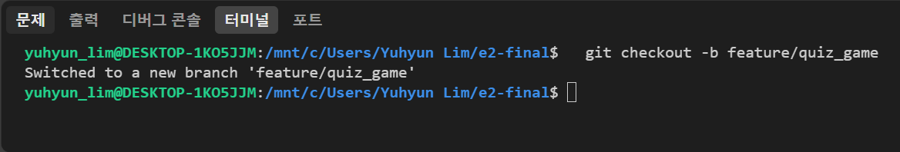

</details>

`-b`는 브랜치를 새로 만들면서 그쪽으로 이동한다는 뜻. 새 브랜치는 현재 커밋에서 갈라진다.

### git log --oneline --graph (병합 전)

```
$ git --no-pager log --oneline --graph --all
* c216597 (HEAD -> feature/quiz_game) Feat: 퀴즈 풀기 기능 구현 (출제, 채점, 결과 표시)
| * 65cea0e (main) Docs: 미션 문서 및 브랜치 생성 스크린샷 추가
|/
* 7ffba24 Feat: 세계 문학 작가 기본 퀴즈 5문제 추가
* 76da1ad (origin/main) Feat: Quiz 클래스 구현 (문제 출력, 정답 확인 메서드 포함)
* 9d19781 Feat: Ctrl+C 및 EOF 발생 시 안전 종료 처리 추가
* 767510c Feat: 메뉴 출력 및 선택 기능 구현
* 3c3ab67 Chore: 저장소 초기 설정 (.gitignore, README 초안 추가)
```

<details>
<summary>git_log_graph_before_merge.png</summary>

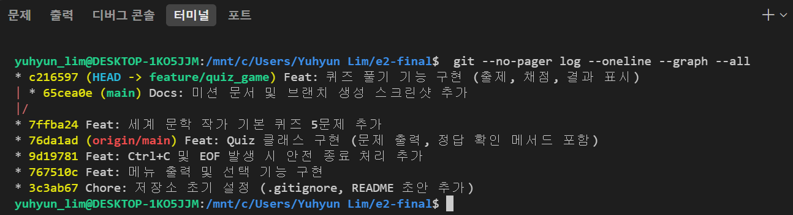

</details>

`7ffba24`에서 두 갈래로 갈라진 상태(`|/`). 왼쪽이 `feature/quiz_game`, 오른쪽이 `main`.

### git log --oneline --graph (병합 후)

```
$ git --no-pager log --oneline --graph
*   cdab26e (HEAD -> main) Merge branch 'feature/quiz_game'
|\
| * c216597 (feature/quiz_game) Feat: 퀴즈 풀기 기능 구현 (출제, 채점, 결과 표시)
* | 65cea0e Docs: 미션 문서 및 브랜치 생성 스크린샷 추가
|/
* 7ffba24 Feat: 세계 문학 작가 기본 퀴즈 5문제 추가
* 76da1ad (origin/main) Feat: Quiz 클래스 구현 (문제 출력, 정답 확인 메서드 포함)
* 9d19781 Feat: Ctrl+C 및 EOF 발생 시 안전 종료 처리 추가
* 767510c Feat: 메뉴 출력 및 선택 기능 구현
* 3c3ab67 Chore: 저장소 초기 설정 (.gitignore, README 초안 추가)
```

<details>
<summary>git_log_graph_after_merge.png</summary>

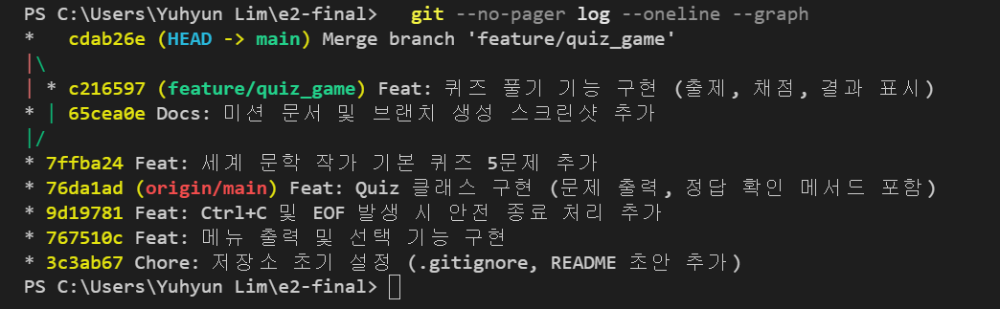

</details>

맨 위에 병합 커밋 `cdab26e`가 생기고, 갈라졌던 두 갈래가 다시 합쳐진다(`|\`). 아래 `|/`(갈라짐)와 위 `|\`(합쳐짐)가 짝을 이뤄 다이아몬드 모양이 된다.

### 커밋 메시지

**형식** — `접두사: 작업 내용`. 접두사 6종만 사용.

| 접두사 | 용도 | 예 |
|---|---|---|
| `Feat` | 새 기능 추가 | `Feat: 퀴즈 풀기 기능 구현 (출제, 채점, 결과 표시)` |
| `Fix` | 잘못 동작하던 것 수정 | `Fix: 0점과 미기록을 구분하도록 play_count 추가` |
| `Docs` | 문서 작업 | `Docs: 작업기록 문서 추가` |
| `Refactor` | 동작 유지, 구조 개선 | `Refactor: 미션 명명 규칙에 맞춰 변수·메서드·JSON 키 정리` |
| `Chore` | 설정 등 부수 작업 | `Chore: 저장소 초기 설정 (.gitignore, README 초안 추가)` |
| `Test` | 테스트 관련 | — |

**기준** — 커밋 하나가 미션 요구사항 하나에 대응. 메뉴 기능, 예외 처리, `Quiz` 클래스, 기본 데이터, 퀴즈 풀기, 추가, 목록, 점수 확인이 각각 별도 커밋.

한 파일에 여러 단계 분량을 한꺼번에 작성한 경우, 해당 단계에 필요한 부분만 남기고 커밋한 뒤 나머지를 이어서 작업. `Feat`와 `Fix`의 구분 기준은 "원래 없던 것을 만들었는가" 대 "있었지만 잘못 동작하던 것을 고쳤는가".

### clone 실습

> 퀴즈 게임 개발 완료 후 진행 예정

```bash
git clone https://github.com/hauteville1862/e2-final.git
```

<details>
<summary>git_clone.png</summary>

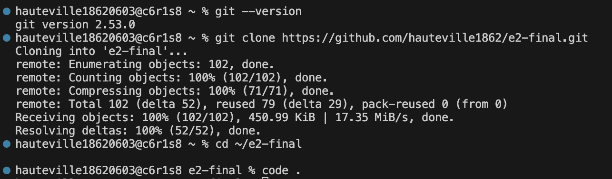

</details>

### pull 실습

> 퀴즈 게임 개발 완료 후 진행 예정

복제한 저장소에서 변경 후 push하고, 기존 작업 디렉터리에서 가져온다.

```bash
git pull
```

<details>
<summary>git_pull.png</summary>

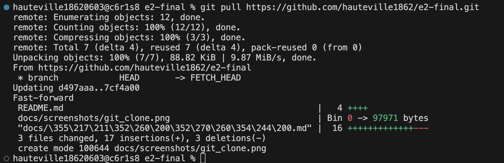

</details>
