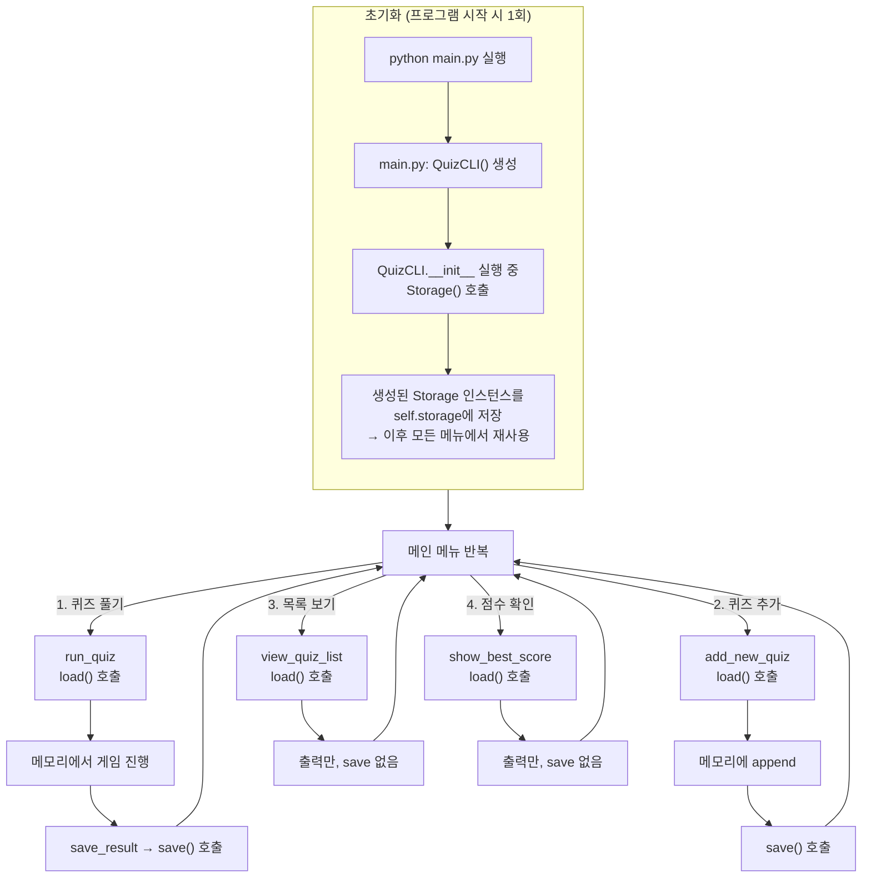

# 평가

## [항목 1] 기능 동작 검증

> 1-1. ~ 1-5. 는 프로그램을 실행하고 저장소를 열어 확인하는 항목이라 별도 설명을 생략함.

### 1-6. 브랜치 생성 및 병합 기록이 `git log --oneline --graph`에서 확인되는가?

**1. `git checkout`으로 새 브랜치를 만들어 작업을 시작한다. 기능이 완성될 때까지 `main`은 건드리지 않는다.**
- `-b`: 브랜치를 새로 만들면서 그쪽 브랜치로 이동함

<details>
<summary>git_branch.png</summary>


</details>

<br>

**2. 작업을 마친 뒤 `git checkout`으로 돌아와 `git merge`로 병합한다.**
- `--no-edit`: 병합 커밋 메시지 편집기가 열리는 것을 막음

<details>
<summary>git_log_graph_after_merge.png</summary>


</details>

### 1-7. clone과 pull 실습 수행 흔적을 README 또는 스크린샷으로 확인할 수 있는가?

**1. `git clone`으로 저장소를 다른 환경(macOS)에 복제한다.**
- 복제 직후 `cd`로 들어가 편집기를 열어 작업을 이어갈 수 있다.
- `cd ~/e2-final`: 복제된 폴더로 이동
- `code .`: 현재 폴더(`.`)를 VS Code 작업 폴더로 열기. `code`는 git 명령이 아니라 VS Code가 PATH에 등록하는 CLI

<details>
<summary>git_clone.png</summary>


</details>

<br>

**2. 복제본에서 README를 고쳐 commit 후 push하고, 원래 작업 디렉터리에서 `git pull`로 가져온다.**
- `Updating d497aaa..7cf4a00`: 가져오기 전 커밋과 가져온 뒤 커밋을 표시
- `Fast-forward`: 원래 디렉터리에 새 커밋이 없어, 병합 커밋을 만들지 않고 브랜치를 앞으로 옮기기만 한 것

<details>
<summary>git_pull.png</summary>


</details>


## [항목 2] 코드 구조 및 설계

### 2-1. Quiz와 QuizGame 등 클래스들의 책임을 어떻게 나눴는지 설명할 수 있는가?

**기준: 무엇이 바뀔 때 이 파일을 고치게 되는가.**

| 클래스 | 담당 로직 | 책임 | 기능 (주요 코드) | 고치게 되는 때 |
|---|---|---|---|---|
| [`Quiz`](../quiz.py) | 없음 | 문제 하나의 데이터와 동작 | • 문제와 선택지 출력<br>• 정답 판정 | 퀴즈 구조 변경 |
| [`QuizGame`](../quiz_game.py) | 게임 진행 | 한 판의 진행 상태 | • 남은 문제 여부 확인<br>• 현재 문제 꺼내기<br>• 채점 후 다음 문제로 이동 | 채점 방식 변경 |
| [`Storage`](../storage.py) | 저장/불러오기 | `state.json` 읽기·쓰기와 손상 복구 | • 파일 읽기·손상 복구 ([`load`](../storage.py#L41-L70))<br>• 파일 쓰기 ([`save`](../storage.py#L72-L81))<br>• 기본 퀴즈 5개 제공 | 저장 형식·위치 변경 |
| [`QuizCLI`](../quiz_cli.py) | 입력 처리 | 메뉴 출력, 입력 검증 | • 메뉴 반복 출력<br>• 퀴즈 풀기·추가·목록·점수 확인 실행<br>• 입력 검증 ([`get_valid_int`](../quiz_cli.py#L10-L28), [`get_nonempty_text`](../quiz_cli.py#L30-L38))<br>• 메뉴 복귀 대기 | 화면 문구·검증 규칙·메뉴 변경 |

### 2-2. "입력 처리(검증)", "게임 진행", "데이터 저장/불러오기" 로직을 어떤 기준으로 분리했는지 설명할 수 있는가?

2-1. 표의 담당 로직 열 참조.

### 2-3. state.json 읽기/쓰기 흐름이 프로그램의 어디에서, 어떤 순서로 발생하는지 설명할 수 있는가?

(1) 파일을 여닫는 코드는 `storage.py`에만 있음.

| 코드 | 역할 |
|---|---|
| [`Storage.load`](../storage.py#L41-L70) | 파일 읽기, 손상 시 기본 데이터로 복구 |
| [`Storage.save`](../storage.py#L72-L81) | 파일 쓰기 |

(2) `Storage` 객체는 한 번만 생성돼 재사용됨. 
- `QuizCLI` 생성 시 만들어진 뒤 계속 쓰임.

```python
class QuizCLI:
    def __init__(self):
        self.storage = Storage()
```

(3) 메뉴 동작이 시작될 때마다 `load()`를 다시 호출해 파일을 처음부터 새로 읽음.

(4) 데이터를 바꾼 경우에만 동작 끝에서 `save()`를 호출해 파일 전체를 다시 씀.

**즉, 메뉴를 선택할 때마다 파일 전체를 다시 읽고, 바뀐 경우에는 전체를 다시 쓰는 구조**

- [`run_quiz`](../quiz_cli.py#L80-L111): 퀴즈 풀이 진행, 정상 종료·중단 시 저장 (진행 중엔 메모리만 사용)
- [`add_new_quiz`](../quiz_cli.py#L113-L134): 퀴즈 추가 후 저장 (load → append → save 순)
- [`view_quiz_list`](../quiz_cli.py#L136-L147): 퀴즈 목록 조회, 읽기 전용
- [`show_best_score`](../quiz_cli.py#L149-L162): 최고 점수 확인, 읽기 전용



### 2-4. Ctrl+C 또는 EOF 상황에서 "안전 종료"를 위해 어떤 처리를 했는지(또는 어떤 처리가 필요했는지) 설명할 수 있는가?

- try/except를 [진입점(main.py)](../main.py#L6-L15)에 둔 이유
- 예외 처리 문법


### 2-5. 커밋을 어떤 단위로 나누었고, 커밋 메시지 규칙을 어떻게 정했는지 설명할 수 있는가?

| 접두사 | 용도 | 예 |
|---|---|---|
| `Feat` | 새 기능 추가 | `Feat: 퀴즈 풀기 기능 구현 (출제, 채점, 결과 표시)` |
| `Fix` | 잘못 동작하던 것 수정 | `Fix: 0점과 미기록을 구분하도록 play_count 추가` |
| `Docs` | 문서 작업 | `Docs: 작업기록 문서 추가` |
| `Refactor` | 동작 유지, 구조 개선 | `Refactor: 미션 명명 규칙에 맞춰 변수·메서드·JSON 키 정리` |
| `Chore` | 설정 등 부수 작업 | `Chore: 저장소 초기 설정 (.gitignore, README 초안 추가)` |

---

## [항목 3] 핵심 기술 원리 적용

### 3-1. 클래스를 사용한 이유는 무엇이며, 함수만으로 구현할 때와 어떤 차이가 있는지 설명할 수 있는가?

- 클래스의 정의: 데이터(속성)와 그 데이터를 다루는 동작(메서드)을 하나로 묶은 것.
- 만약 함수만으로 퀴즈게임을 구현한다면?

```python
class Quiz:
    def __init__(self, question, choices, answer):
        self.question = question
        self.choices = choices
        self.answer = answer

    def show(self, quiz_number):
        print(f"\nQ.{quiz_number}: {self.question}")
        for number, choice in enumerate(self.choices, 1):
            print(f"   {number}) {choice}")

    def is_correct(self, user_answer):
        return user_answer == self.answer
```


### 3-2. JSON 파일로 데이터를 저장하는 이유와 JSON 형식의 특징을 설명할 수 있는가?

(1) 프로그램을 꺼도 데이터가 남아있어야 함.

(2) 사람들이 많이 씀.

(3) 파이썬의 딕셔너리, 리스트와 그대로 대응되어 저장하고 불러오기가 간단함.

### 3-3. 파일 입출력에서 try/except가 필요한 이유(발생 가능한 실패 케이스 포함)를 설명할 수 있는가?

- [`Storage.load`](../storage.py#L41-L70)
    - `FileNotFoundError` (파일 없음 = 첫 실행): 안내 없이 기본 퀴즈 5개 사용.
    - `OSError` (권한 문제 등 그 외 접근 불가): 안내 후 기본 퀴즈 5개 사용.
    - `ValueError` (JSON 문법 오류, 필수 키 누락, 딕셔너리가 아님 등 내용 문제): 안내 후 기본 데이터로 초기화. 저장 데이터가 사라지는 상황이므로 반드시 알림.


### 3-4. 브랜치를 분리해 작업한 이유와 병합(merge)의 의미를 설명할 수 있는가?

(1) 협업: 각자 브랜치에서 작업하면 서로의 코드를 건드리지 않음.

(2) 새로운 기능 추가: 기능이 완성되기 전까지 `main`은 건드리지 않아도 됨. 
- ex) 퀴즈 풀기 기능을 `feature/quiz_game`에서 작업 후 `main`에 병합.

### 3-5. state.json 데이터 구조(필드/중첩 구조)를 현재 형태로 설계한 이유를 설명할 수 있는가?

- [`state.json`](../state.json)

## [항목 4] 심층 인터뷰

### 4-1. 퀴즈 데이터가 1000개 이상으로 늘어난다면 현재 JSON 저장 방식에 어떤 한계가 생길 수 있는지 설명할 수 있는가?

(1) 데이터 전체를 읽고 쓰는 구조는 문제 수가 늘어나면 비효율적.

(2) DB는 아이디로 해당 문제를 바로 찾을 수 있지만, JSON은 처음부터 전체를 읽어야 함.

### 4-2. 만약 state.json이 손상되어 JSON 파싱에 실패한다면, 사용자가 데이터를 잃지 않도록 어떤 대응(복구/백업/초기화)이 가능한지 설명할 수 있는가?

- [`storage.py`](../storage.py)

### 4-3. "정답 채점 방식(점수 계산)"이나 "퀴즈 구조(선택지 개수 등)" 요구사항이 바뀐다면, 어떤 파일/클래스/메서드를 먼저 수정해야 하는지 설명할 수 있는가?

| 요구사항 | 파일 | 함수 |
|---|---|---|
| 점수 계산 방식 | `quiz_game.py`, `quiz_cli.py` | [`QuizGame.submit_answer`](../quiz_game.py#L13-L20), [`save_result`](../quiz_cli.py#L69-L78) |
| 선택지 개수 | `quiz.py`, `quiz_cli.py` | [`Quiz.show`](../quiz.py#L7-L10)(출력), `add_new_quiz`의 [`range(1, 5)`](../quiz_cli.py#L119)·[`get_valid_int` 호출부](../quiz_cli.py#L122) |

