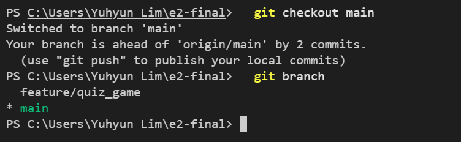

# 5. 평가문항

## [항목 1] 기능 동작 검증

> 1-1 ~ 1-5는 프로그램을 실행하고 저장소를 열어 확인하는 항목이라 별도 설명을 생략함.

### 1-6. 브랜치 생성 및 병합 기록이 `git log --oneline --graph`에서 확인되는가?

1. `git checkout`으로 새 브랜치를 만들어 작업을 시작한다. 기능이 완성될 때까지 `main`은 건드리지 않는다.
- `-b`: 브랜치를 새로 만들면서 그쪽 브랜치로 이동함

<details>
<summary>git_branch.png</summary>


</details>

<br>

2. 작업을 마친 뒤 `git checkout`으로 돌아와 `git merge`으로 병합한다.
- `--no-edit`: 병합 커밋 메시지 편집기가 열리는 것을 막음

<details>
<summary>git_checkout_main.png</summary>



</details>

<details>
<summary>git_log_graph_after_merge.png</summary>


</details>

### 1-7. clone과 pull 실습 수행 흔적을 README 또는 스크린샷으로 확인할 수 있는가?

1. `git clone`으로 저장소를 다른 환경(macOS)에 복제한다. 
- 복제 직후 `cd`로 들어가 편집기를 열어 작업을 이어갈 수 있다.
- `cd ~/e2-final`: 복제된 폴더로 이동
- `code .`: 현재 폴더(`.`)를 VS Code 작업 폴더로 열기. `code`는 git 명령이 아니라 VS Code가 PATH에 등록하는 CLI

<details>
<summary>git_clone.png</summary>


</details>

<br>

2. 복제본에서 README를 고쳐 commit 후 push하고, 원래 작업 디렉터리에서 `git pull`로 가져온다.
- `Updating d497aaa..7cf4a00`: 가져오기 전 커밋과 가져온 뒤 커밋을 표시
- `Fast-forward`: 원래 디렉터리에 새 커밋이 없어, 병합 커밋을 만들지 않고 브랜치를 앞으로 옮기기만 한 것

<details>
<summary>git_pull.png</summary>


</details>

`clone`은 저장소를 통째로 처음 가져오는 것이고, `pull`은 이미 가진 저장소에 원격의 새 커밋만 반영하는 것이다. 실제로 이 실습에서도 clone은 폴더 전체를 만들었고, pull은 바뀐 3개 파일만 가져왔다.

---

## [항목 2] 코드 구조 및 설계

### 2-1. Quiz와 QuizGame 등 클래스들의 책임을 어떻게 나눴는지 설명할 수 있는가?

기준: **무엇이 바뀔 때 이 파일을 고치게 되는가.**

| 클래스 | 책임 | 기능 | 고치게 되는 때 |
|---|---|---|---|
| [`Quiz`](../quiz.py) | 문제 하나의 데이터(지문·선택지·정답)와 동작 | 문제와 선택지 출력, 정답 판정 | 퀴즈 구조 변경 |
| [`QuizGame`](../quiz_game.py) | 한 판의 진행 상태 — 현재 문제 번호, 점수 | 남은 문제 여부 확인, 현재 문제 꺼내기, 채점 후 다음 문제로 이동 | 채점 방식 변경 |
| [`Storage`](../storage.py) | `state.json` 읽기·쓰기와 손상 복구 | 파일 읽기와 손상 시 복구, 파일 쓰기, 기본 퀴즈 5개 제공 | 저장 방식 변경 |
| [`QuizCLI`](../quiz_cli.py) | 메뉴 출력, 입력 검증, 위 셋을 조합해 기능 완성 | 메뉴 반복 출력, 퀴즈 풀기·추가·목록·점수 확인 실행, 숫자와 빈 문자열 입력 검증, 메뉴 복귀 대기 | 화면 문구·메뉴 변경 |

### 2-2. "입력 처리(검증)", "게임 진행", "데이터 저장/불러오기" 로직을 어떤 기준으로 분리했는지 설명할 수 있는가?

기준: **무엇이 바뀔 때 이 파일을 고치게 되는가.** 2-1의 잣대를 세 로직에 그대로 적용했다.

| 로직 | 파일 | 코드 | 고치게 되는 때 |
|---|---|---|---|
| 입력 처리 | `quiz_cli.py` | [`get_valid_int`](../quiz_cli.py#L10-L28), [`get_nonempty_text`](../quiz_cli.py#L30-L38) | 화면 문구·검증 규칙 변경 |
| 게임 진행 | `quiz_game.py` | [`QuizGame`](../quiz_game.py) | 채점 방식 변경 |
| 저장/불러오기 | `storage.py` | [`Storage.load`](../storage.py#L41-L70), [`Storage.save`](../storage.py#L72-L81) | 저장 형식·위치 변경 |

세 요구가 각각 파일 하나씩만 건드린다는 것이 잘 나뉘었다는 증거다. 코드로도 확인된다 — 입력 처리는 `input()`, 저장/불러오기는 `open()`으로 바깥과 이야기하지만 `quiz_game.py`에는 `print`·`input`·`import`가 하나도 없다.

입력 처리를 함수 둘로 나눈 것도 같은 잣대다. 검사 대상이 달라서 — `get_valid_int`는 숫자와 범위, `get_nonempty_text`는 빈 문자열.

### 2-3. state.json 읽기/쓰기 흐름이 프로그램의 어디에서, 어떤 순서로 발생하는지 설명할 수 있는가?

파일을 직접 여는 코드는 [`storage.py`](../storage.py)에만 있다. 다른 파일은 아래 두 메서드를 부르기만 한다.

| 동작 | 메서드 |
|---|---|
| 읽기 | [`Storage.load`](../storage.py#L41-L70) |
| 쓰기 | [`Storage.save`](../storage.py#L72-L81) |

### 2-4. Ctrl+C 또는 EOF 상황에서 "안전 종료"를 위해 어떤 처리를 했는지(또는 어떤 처리가 필요했는지) 설명할 수 있는가?

기준: **저장은 데이터를 아는 곳에서, 종료 안내는 진입점에서.**

| 처리 | 코드 |
|---|---|
| 종료 안내 후 `sys.exit(0)` | [`main.py` 진입점](../main.py#L8-L15) |
| 퀴즈 도중이면 먼저 저장하고 인자 없는 `raise` | [`run_quiz`](../quiz_cli.py#L95-L104) |

### 2-5. 커밋을 어떤 단위로 나누었고, 커밋 메시지 규칙을 어떻게 정했는지 설명할 수 있는가?

| 접두사 | 용도 | 예 |
|---|---|---|
| `Feat` | 새 기능 추가 | `Feat: 퀴즈 풀기 기능 구현 (출제, 채점, 결과 표시)` |
| `Fix` | 잘못 동작하던 것 수정 | `Fix: 0점과 미기록을 구분하도록 play_count 추가` |
| `Docs` | 문서 작업 | `Docs: 작업기록 문서 추가` |
| `Refactor` | 동작 유지, 구조 개선 | `Refactor: 미션 명명 규칙에 맞춰 변수·메서드·JSON 키 정리` |
| `Chore` | 설정 등 부수 작업 | `Chore: 저장소 초기 설정 (.gitignore, README 초안 추가)` |

---

## [항목 3] 핵심 기술 원리 적용

### 3-1. 클래스를 사용한 이유는 무엇이며, 함수만으로 구현할 때와 어떤 차이가 있는지 설명할 수 있는가?

### 3-2. JSON 파일로 데이터를 저장하는 이유와 JSON 형식의 특징을 설명할 수 있는가?

### 3-3. 파일 입출력에서 try/except가 필요한 이유(발생 가능한 실패 케이스 포함)를 설명할 수 있는가?

| 상황 | 잡는 예외 | 동작 |
|---|---|---|
| 파일 없음(첫 실행), 열 수 없음(권한 문제 등) | `OSError` | 안내 없이 기본 퀴즈 5개 사용 |
| JSON 문법 오류, 필수 키 누락, 딕셔너리가 아님 | `ValueError` | 안내 후 기본 데이터로 초기화 |

파일에 **접근 불가**한 것은 사용자 잘못이 아니고 첫 실행도 여기 해당하므로 조용히 처리. **내용이 잘못된** 것은 저장 데이터가 사라지는 상황이므로 반드시 알린다.

<details>
<summary>파일 불러오기 코드 (storage.py)</summary>

```python
    def load(self):
        try:
            with open(self.path, "r", encoding="utf-8") as file:
                data = json.load(file)

            if not isinstance(data, dict):
                raise ValueError("state.json이 올바른 형태가 아닙니다.")

            if "best_score" not in data or "quizzes" not in data:
                raise ValueError("state.json 구조가 올바르지 않습니다.")

            if "play_count" not in data:
                data["play_count"] = 0

            return data

        except OSError:
            return self.get_default_data()

        except ValueError:
            print("\n[알림] 데이터 파일이 손상되어 기본 퀴즈 데이터로 초기화합니다.")
            recovered = self.get_default_data()
            self.save(recovered)
            return recovered
```

`json.load()`가 던지는 `JSONDecodeError`는 `ValueError`의 하위 클래스라 자동으로 걸린다. 키 누락은 직접 `ValueError`를 던져, "문법은 맞지만 내용이 잘못된 파일"까지 같은 경로로 처리.

</details>

### 3-4. 브랜치를 분리해 작업한 이유와 병합(merge)의 의미를 설명할 수 있는가?

퀴즈 풀기 기능은 `feature/quiz_game` 브랜치에서 작업 후 `main`에 병합했다. 브랜치를 나누면 기능 완성 전까지 `main`을 건드리지 않아도 되고, 병합 커밋이 "어떤 작업이 언제 합쳐졌는지"를 이력에 남긴다.

병합 전에는 두 갈래로 갈라져 있고(`|/`), 병합 후 다시 합쳐진다(`|\`). 병합 커밋은 부모가 둘이라 이런 모양이 생긴다. 그래프는 1-6에 있다.

### 3-5. state.json 데이터 구조(필드/중첩 구조)를 현재 형태로 설계한 이유를 설명할 수 있는가?

스키마와 필드 설명은 README VI절에 있다. 여기서는 `play_count`를 왜 뒀는지를 설명한다.

초기 구현은 `best_score`만 저장. 5문제를 모두 틀려 0점을 받은 뒤 점수를 확인하니 "아직 퀴즈를 풀지 않았다"고 표시됐다. **한 번도 풀지 않아 0점**인 경우와 **풀었지만 0점**인 경우가 데이터상 구별되지 않았기 때문.

원인은 숫자 하나에 "최고 점수가 몇 점인가"와 "플레이한 적이 있는가" 두 의미를 담으려 한 것. 푼 횟수를 별도 필드로 분리해 해결.

---

## [항목 4] 심층 인터뷰

### 4-1. 퀴즈 데이터가 1000개 이상으로 늘어난다면 현재 JSON 저장 방식에 어떤 한계가 생길 수 있는지 설명할 수 있는가?

### 4-2. 만약 state.json이 손상되어 JSON 파싱에 실패한다면, 사용자가 데이터를 잃지 않도록 어떤 대응(복구/백업/초기화)이 가능한지 설명할 수 있는가?

### 4-3. "정답 채점 방식(점수 계산)"이나 "퀴즈 구조(선택지 개수 등)" 요구사항이 바뀐다면, 어떤 파일/클래스/메서드를 먼저 수정해야 하는지 설명할 수 있는가?

---

## 참고

### 개발환경

미션은 Python 3.10 이상, 외부 라이브러리 없이 표준 라이브러리만 사용할 것을 요구한다. 두 환경 모두 이를 만족한다.

| 항목 | 개발 환경 | 실행 확인 환경 |
|---|---|---|
| OS | Windows 11 | macOS 15.7.7 |
| 언어 | Python 3.14.6 | Python 3.12.13 |
| 터미널 | PowerShell, WSL(Ubuntu) | zsh |
| 버전 관리 | Git 2.55.0.windows.3 | Git 2.53.0 |
| 편집기 | Visual Studio Code | Visual Studio Code |
| 외부 라이브러리 | 없음 (표준 라이브러리만) | 없음 |

### 과제 목표

Python 기본 문법으로 콘솔 프로그램 하나를 처음부터 끝까지 완성하고, 그 과정을 Git으로 기록한다.

- **객체 지향** — 역할이 다른 클래스로 코드 분리
- **데이터 영속성** — JSON 파일 저장으로 종료 후에도 데이터 유지
- **예외 처리** — 잘못된 입력, 강제 종료, 손상된 데이터 파일에도 비정상 종료 없음

Git 측면에서는 기능 단위 커밋, 브랜치 분리와 병합, 원격 저장소 활용(`clone` / `pull`)을 직접 수행했다.
